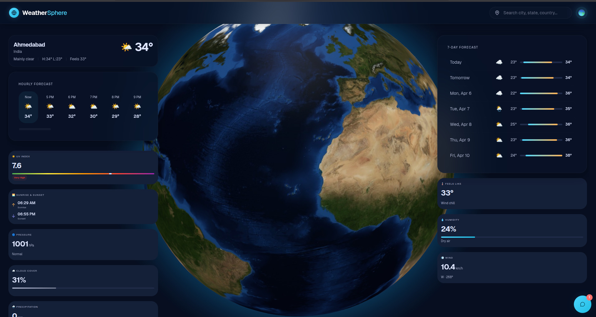
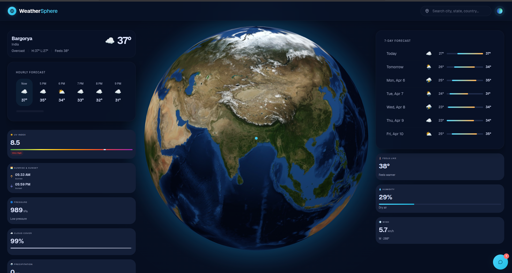
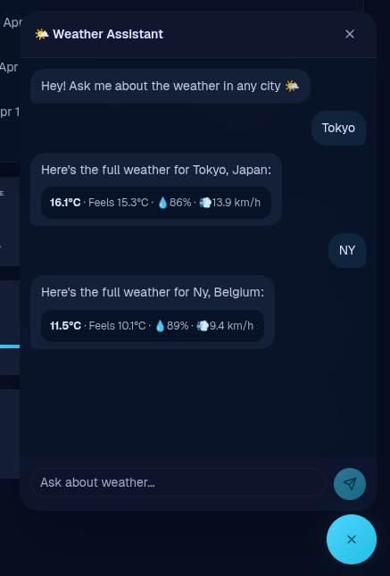

# WeatherSphere

A weather dashboard with an interactive 3D globe, real-time forecasts, and a built-in weather assistant chatbot.







## Features

- Interactive 3D globe — click anywhere to get weather for that location
- Real-time current conditions (temperature, feels like, humidity, wind, pressure, UV index, cloud cover, precipitation)
- 7-day daily forecast with min/max temperature range bars
- 24-hour hourly forecast
- Sunrise & sunset times
- City search with autocomplete (geocoding)
- Auto-detects your location on load
- Weather Assistant chatbot — ask about weather in any city by name
- Dark, space-themed UI

## Tech Stack

- React 19 + TypeScript
- Vite
- Tailwind CSS v4
- shadcn/ui components
- react-globe.gl — 3D globe rendering
- Lucide React — icons
- Geist variable font

## Data Sources

All weather data is free, no API key required:

- [Open-Meteo](https://open-meteo.com/) — current conditions, hourly & daily forecasts
- [Open-Meteo Geocoding API](https://open-meteo.com/en/docs/geocoding-api) — city search
- [BigDataCloud Reverse Geocode](https://www.bigdatacloud.com/free-api/free-reverse-geocode-to-city-api) — coordinates to city name

## Getting Started

```bash
npm install
npm run dev
```

Then open [http://localhost:5173](http://localhost:5173).

## Build

```bash
npm run build
```

## Project Structure

```
src/
├── components/
│   ├── atoms/        # ChatBubble, DetailCard, Spinner
│   ├── molecules/    # DailyRow, HourlyItem, SearchBar
│   ├── organisms/    # WeatherHero, HourlyForecast, DailyForecast, DetailGrid, ChatWidget
│   ├── templates/    # WeatherDashboard
│   └── ui/           # shadcn/ui primitives
├── domain/           # TypeScript types
├── features/globe/   # GlobeView component
├── hooks/            # useWeather hook
├── services/         # weatherApi, chatLogic
└── utils/            # weatherUtils (codes, icons, labels)
```
